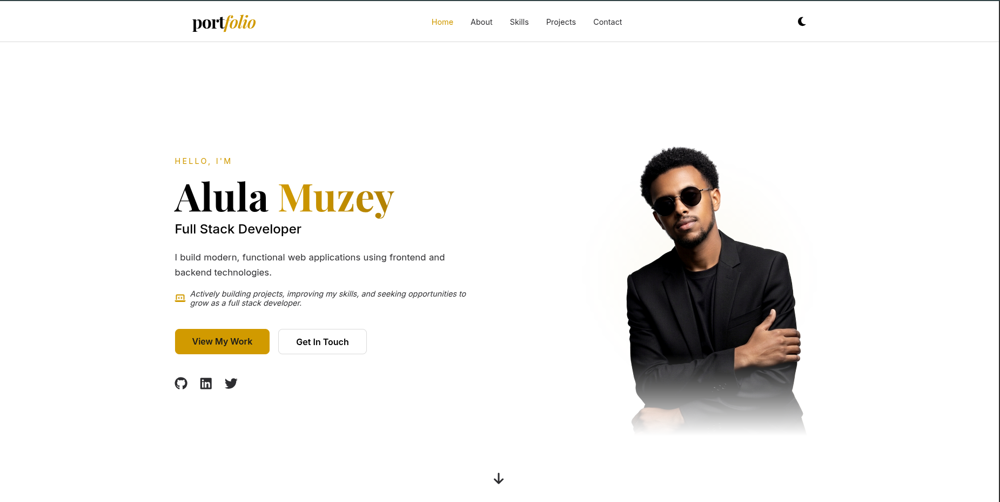
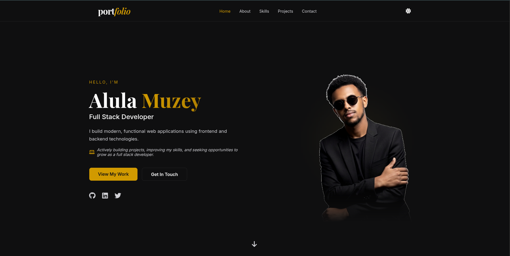
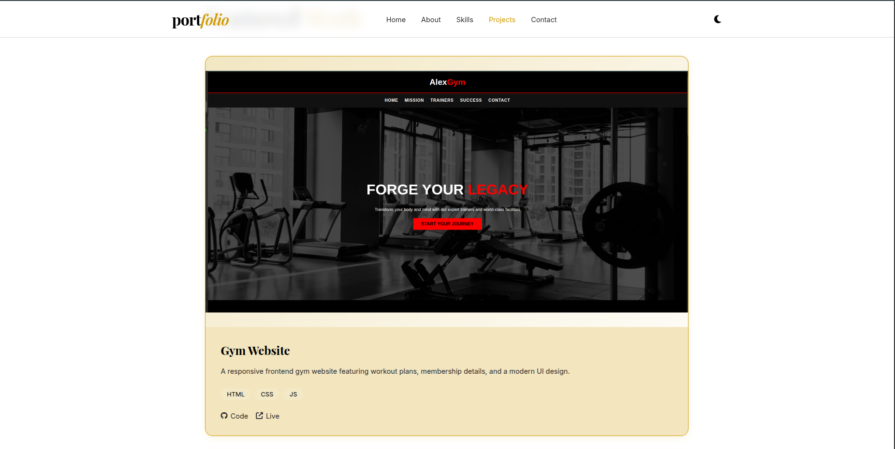
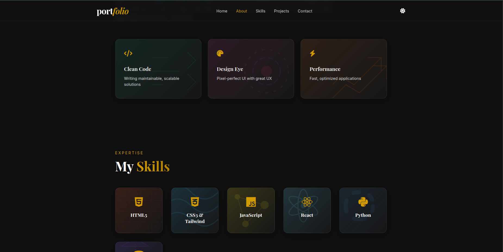

# Modern Personal Portfolio

A sleek, responsive, and modern personal portfolio website built for Alula Muzey, an aspiring full-stack developer.

## 📸 Preview

| Light Home | Dark Home |
|---|---|
|  |  |
|  |  |

## ✨ Features
- **Dark & Light Mode:** Seamlessly toggle between a high-contrast light UI and a crisp, premium dark mode with user preference saved in local storage.
- **Interactive Project Showcase:** Features auto-playing image slideshows and creative terminal-style layouts to display projects.
- **Fully Responsive:** Optimized for desktop, tablet, and mobile devices.
- **Smooth Animations:** Scroll-spy navigation, fade-in loading cascades, and interactive hover effects.
- **Functional Contact Form:** Built-in Node.js backend to capture form submissions and email them directly to your inbox via Nodemailer.

## 🚀 Tech Stack

**Frontend:**
- HTML5 (Semantic Structure)
- CSS3 (Flexbox, CSS Grid, Custom Variables, Keyframe Animations)
- Pure JavaScript (DOM manipulation, IntersectionObserver, Fetch API)

**Backend:**
- Node.js
- Express.js (REST API processing)
- Nodemailer (Email delivery integration)
- CORS (Cross-Origin Resource Sharing)

## 📁 Project Structure

```text
FUTURE_FS_01/
├── README.md
├── index.html
├── style.css
├── script.js
├── assets/
│   ├── bg/             # Custom SVG backgrounds for feature/skill cards
│   └── screenshots/    # README preview screenshots
└── backend/
	├── index.js
	└── package.json
```

## 🛠️ How to Run Locally

### 1. Start the Backend Server
The project uses a local Express server to handle contact form submissions.
```bash
cd backend
npm install
node index.js
```
*Note: The server will run on `http://localhost:3000`.*

### 2. View the Frontend
Open `index.html` in your browser. For the development experience, it is highly recommended to use the **Live Server** extension in VS Code.

## 📬 Contact Form Configuration
If you need to change your email or re-authenticate in the future:
1. Ensure 2-Step Verification is on for your Google Account.
2. Go to `https://myaccount.google.com/apppasswords` and generate a new **App Password**.
3. Place the 16-character password into `backend/index.js` inside the `transporter` auth object.

---
*Developed by Alula Muzey*
